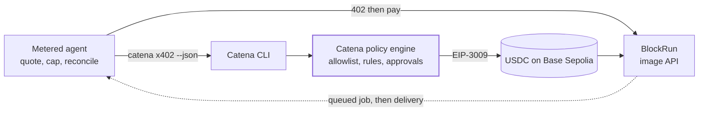

# catena-x402-metered-agent-demo

A metered agent that consumes a real pay-per-request x402 endpoint
(BlockRun's image-generation API on Base Sepolia) and pays each call from a
Catena account, with a configured spend cap enforced before any money moves.



Each call follows the x402 cycle: request → 402 challenge → pay → retry →
response. The runner tracks a running spend total in exact bigint
micro-dollars and refuses the first call that would push the total past the
cap. Payments draw from a Catena-governed wallet account, so the platform's
own controls (counterparty allowlist, spend limits, approval thresholds)
rule every spend independently of this repo's bookkeeping.

The default run tells the whole story in under a minute: three calls, a
$0.05 cap, images at about $0.021 each. Two of them pay ($0.042 of the cap
spent). The third is quoted at $0.021 against the $0.008 that is left, so it
is refused before payment and never reaches the CLI. The run still exits 0,
because a cap that binds is the demo working.

Where the refusal sits relative to Catena's own policy engine:
[the policy flow diagram](docs/architecture.md#where-enforcement-lives) in
[docs/architecture.md](docs/architecture.md).

## Setup (sandbox, ~15 minutes)

Requires Node >= 22.13 and pnpm.

**1. Install and link the Catena CLI to a sandbox account.** Non-production
Catena environments serve `base-sepolia`; production serves `base`, and this
demo pays a Base Sepolia challenge, so a production account cannot pay it
(the CLI answers `networkMismatch` and charges nothing).

Verified against @catena/cli 0.4.0 (fixtures recorded from 0.3.0 and
re-verified against 0.4.0; the changes are additive).

```sh
npm i -g @catena/cli    # v0.3.0 or newer: --header support
catena link             # follow the device-link prompts
catena accounts list    # note the account id and confirm it is a sandbox wallet
```

**2. Fund that account with Base Sepolia USDC.** The account pays for every
call, so it needs a balance before the first run:

```sh
catena accounts deposit-address <account-id>   # where to send the USDC
catena accounts balance <account-id>           # confirm before running
```

Send that address testnet USDC from
[faucet.circle.com](https://faucet.circle.com) (select Base Sepolia). A few
dollars covers hundreds of calls at $0.021 each. No ETH is needed:
settlement is a gasless EIP-3009 transfer.

**3. Configure this repo.**

```sh
pnpm install
cp .env.example .env   # set CATENA_ACCOUNT_ID and CATENA_PROFILE
```

**4. Allow the endpoint as a counterparty.** Catena never auto-adds a 402's
`payTo`, so this stays a deliberate, policy-gated step. The runner prints
the exact command when it is missing:

```sh
catena counterparties create wallet --name 'BlockRun testnet' \
  --address '0xe9030014F5DAe217d0A152f02A043567b16c1aBf' --network base-sepolia
```

Then allow it in the policy: Catena console > Governance > Policies > your
policy > "Send money" > Authorized counterparties.

## Run

```sh
pnpm demo                                              # three calls, cap binds on the third
pnpm demo --calls 2 --prompt "a robot paying a toll booth"
```

Each call pays ~$0.021 of testnet USDC for one gpt-image-1 generation and
prints the delivered image URL, the settlement status and the running total.
Lower `SPEND_CAP_USD` (or raise `--calls`) to make the cap bind sooner: the
first call that would exceed it is refused before payment.

**Use the image flow.** The agent also speaks the chat flow
(`ENDPOINT_KIND=chat`,
`ENDPOINT_URL=https://testnet.blockrun.ai/api/v1/chat/completions`,
`MODEL=openai/gpt-oss-20b`), but BlockRun's testnet chat upstream currently
fails after the payment authorizes, so the run reports
charged-without-delivery and exits non-zero. That is the honest behavior of
the code, not a passing demo.

**Exit codes:**

| Code | Meaning                                                                                         |
| ---- | ----------------------------------------------------------------------------------------------- |
| 0    | Every call finished under the cap, including a clean cap stop and a payment parked for approval |
| 1    | A call failed, or was charged without delivery                                                  |
| 2    | A setup problem: bad config, missing account, counterparty not saved                            |

**Approval-threshold demo:** in the Catena console open Governance >
Policies > your policy > "Send money" > Rules > "+ Add rule" and set an
approval threshold below the price of a call (e.g. $0.015 with the $0.021
image price). Run once: the CLI parks the payment as a pending intent
instead of paying, and it appears under Governance > Approvals. Approve it,
re-run the same command, and the retry consumes the approval.

## Tests

`pnpm test`: unit and integration tests run against a local fake 402 endpoint
and a stub CLI binary (fixtures recorded from @catena/cli 0.3.0, re-verified
against 0.4.0). They never touch the network or move money.

`pnpm check` runs the whole CI gate:

```sh
pnpm format:check && pnpm lint && pnpm typecheck && pnpm test
```

## Scope

This repo consumes public surfaces only: the public x402 flow of a third-party
endpoint, and the released Catena CLI as a customer payment surface. It does
not implement, reproduce, or reach into Catena's policy engine, platform core,
or SDK internals; the spend meter here is client-side bookkeeping, and the
authoritative controls stay on the platform side.

## License

MIT
