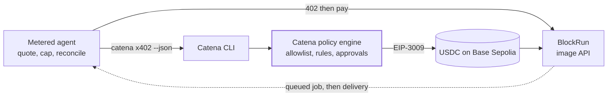
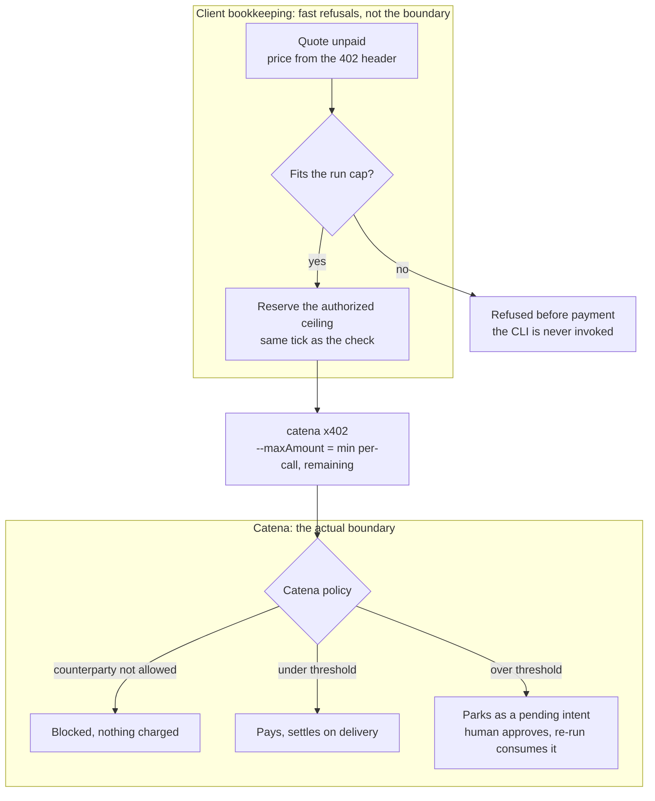
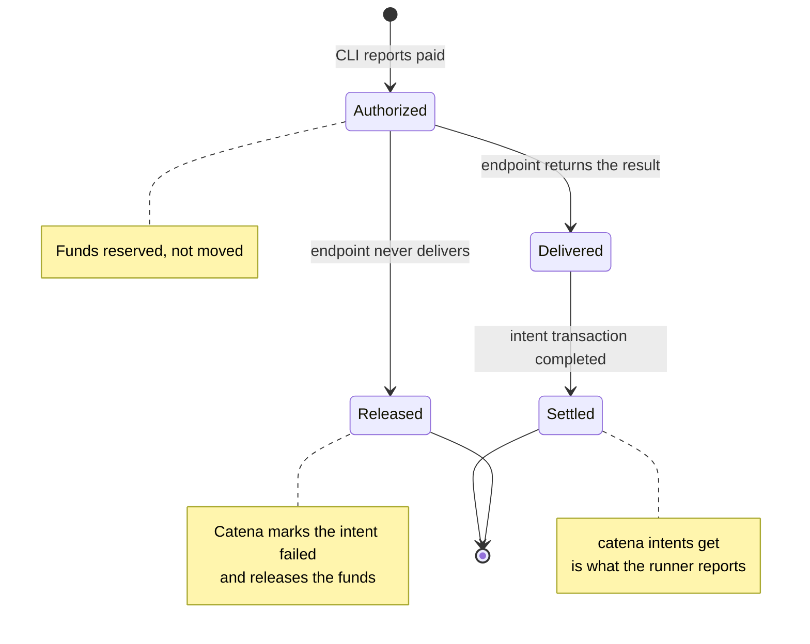

# Architecture

## Where enforcement lives

Two independent layers, by design:

- **Client-side bookkeeping (this repo).** The meter counts authorized
  amounts in exact bigint micro-dollars and refuses a call before payment
  when it would pass `SPEND_CAP_USD`. The CLI authorization is clamped to
  the remaining budget, so even a challenge that changed after the quote
  cannot push the total past the cap. This layer is convenience and
  fast feedback; it is not the security boundary.
- **Platform-side policy (Catena).** The account's policy rules bind every
  spend regardless of what this process does: counterparty allowlist
  (payTo must be saved and allowed), and rule types configured in the
  console (per-transaction limit, daily/weekly/monthly spending limits,
  hourly/daily transaction limits, approval threshold). An over-threshold
  payment parks as an intent for a human; re-running the same command
  consumes the approval.

## Payment truth has three stages

The demo treats these as distinct, because they are:

1. **Authorized** - the x402 exchange succeeded and the CLI reports `paid`.
   Funds are reserved, not moved.
2. **Delivered** - the endpoint produced the result. BlockRun settles on
   the completing poll (pay-on-delivery); an endpoint that fails after
   authorizing never settles, Catena marks the intent failed and releases
   the funds (observed live against a broken upstream).
3. **Settled** - the intent's inner transaction reports completed. The
   agent reads this back with `catena intents get` after every payment and
   the runner prints a per-status tally rather than assuming success.

A charged-but-undelivered call is always surfaced as `paid_but_error` and
the runner exits non-zero. Polling is fail-closed in every direction: a
transport rejection or unreadable body is retried until the deadline; a
non-ok HTTP response is wrapped as an error even when its JSON body looks
benign; a body still claiming `queued` at the deadline (or one that never
carried a usable `poll_url`) reports as charged-without-delivery rather
than success. Each attempt carries an `AbortSignal` bounded by what is left
of the deadline, so the configured limit is a real time bound.

When the CLI does not report the charged amount, the meter records the
amount that was **authorized** (`--maxAmount`), never the cheaper probe
quote: the CLI pays whatever the seller's own challenge asks up to that
ceiling, and under-recording would let a later call slip past the cap.

## Why `exact`, and what `upto` would change

The x402 scheme in production today is `exact`: the price is fixed by the
challenge before the call runs. True usage-based metering (settle actual
consumption up to a signed maximum) is the `upto` scheme, which exists as a
spec draft but has no facilitator or SDK implementation yet. Providers
bridge the gap by flat-pricing per request (BlockRun testnet) or pricing
the maximum envelope. This demo's metering - fixed-price calls behind a
running cap - is how the ecosystem meters today; when `upto` lands, the
same cap logic applies to the authorized maximum instead of a fixed price.

## Known limits

- **At-most-once, no idempotency key.** If the CLI is killed mid-payment
  the intent may already be in flight; the wrapper says so and points at
  the console instead of retrying blindly. Production would derive an
  idempotency key from the payment authorization.
- **Single-process meter.** The spend total lives in one process. Within it,
  the cap is concurrency-safe: a call reserves its authorized ceiling in the
  same tick as the check and settles to the actual charge afterwards, so two
  calls in flight cannot both pass a budget only one fits. Across processes
  or machines, the platform-side rules are what bind.
- **BlockRun testnet upstreams vary.** Chat models currently fail after
  authorization (upstream credential errors, reported to BlockRun);
  OpenAI image models deliver. The endpoint, model and kind are env
  configuration, so a fixed upstream is a `.env` change away.
